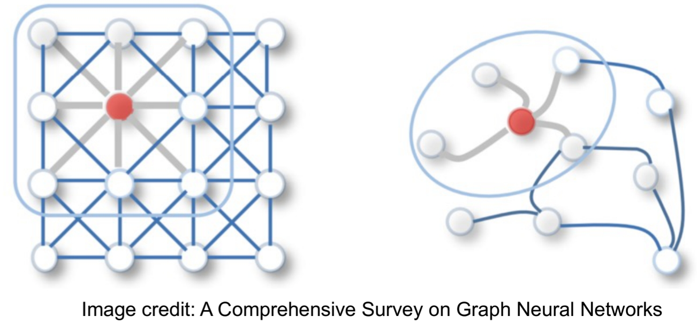

# GNN(Graph Neural Network)

## What is a Graph?
- 객체간의 관계를 표현하는 것이다.
- 각 객체는 node or vertex로 표현된다.
- 관계는 edge로 표현된다.
- Graph는 엔티티를 관계와 상호작용과 함께 설명하고 분석하기 위한 일반적인 언어이다.

## 현실 세계에서 Graph Data 예시
- Social Networks
- Traffic, Subway Maps
- Computer Networks
- Protein-Protein Interaction
- Chemical Compounds
- Knowledge Graphs
- Citation Networks
- Networks of Neurons

## Graph 개념이 머신러닝에서 발전된 과정
|-|-|
|**Category**|**Examples**|
|Traditional Methods|Graphlets, Graph Kernels|
|Node embedding methods|DeepWalk,node2vec|
|Graph Neural Networks(GNNs)|GCN, GraphSage, GAT..|

### Node Embedding(Node Representation Learning)
그래포 G = (V, E) 가 주어졌을 때 아래와 같이 노드 임베딩을 만든다.

그리고 Graph에서  가깝거나 같은 그룹인 경우 N차원 공간에서도 유사하게 위치하는게 목표다.

그렇다면 유사하게 위치하기 위해서는 유사도를 구해야 하는데 내적, 코사인유사도 같은 방법으로 계산한다.

### Transductive vs Inductive
임베딩을 학습하는 방법은 2가지이다.
1. Transductive : 학습결과가 노드 임베딩 그 자체인 것(= 노드임베딩이 파라미터)
   - 학습을 하는 동안 보지 못한 노드는 임베딩을 못 만든다.
   - 필요한 파라미터 수가 노드 수에 비례해서 커지기 때문에 확장성이 없다.
   - 테스트 데이터가 학습 과정에서 그래프에 포함되어 있음.
   - node feature를 node embedding에 포함하기 힘들다.
2. Inductive : 학습결과가 encoder인 것(= 노드임베딩을 만드는 함수를 구한다.)
   - 못 본 노드도 임베딩을 생성 가능하다. (Transductive의 대안으로 나옴)
   - 학습에서 훈련 중에는 테스트데이터에 접근하지 않음.(2020,2021년 데이터 훈련, 2022년 데이터 테스트)
   - 이러한 기술이 바로 GNN이다.

|-|-|-|
|특징|Transductive|Inductive|
|테스트노드|학습 중에 그래프에 포함됨|학습 중에 포함되지 않음|
|일반화|새로운 노드에 대한 예측 불가|새로운 노드에 대한 예측 가능|
|그래프 구조 활용|테스트 노드의 구조적 정보 사용 가능|훈련 시 주어진 그래프 구조만 사용|
|적용 예시|노드 분류 문제|새로운 그래프나 노드 예측|
|응용 가능성|고정된 환경에서 성능 우수|유연성이 요구되는 상황에 적합|

## GNN
### GNN Intro
그패르 구조 데이터를 처리하고 분석하는데 사용되는 인공지능 모델이다. 그래프는 node edge로 구성되며, 각각의 node는 entity를, edge는 relationship을 나타낸다.
복잡한 구조적 데이터를 처리하는데 적합하다.
- grid or sequence 같이 표현이 정형화되지 않을 때
- 관계 구조를 어떻게 활용해서 더 나은 예측이 필요할 때

### GNN Task Type
- Graph-level

  - Graph generation(바이오,화학에서 새로운 화합물,유기물 조합 시)
  - Graph classification(각 그래프들의 카테고리 분류)
- Node-level
  - Node embedding/Node classification(단백질 접힘 문제, e커머스 유저/상품 관계)
- Edge-level
  - Link prediction(entity간에 relationship이 있는지?)
    

### Example

#### 지도학습 및 비지도학습 개념이 들어간다면?(저자 네트워크 예시)

semi는 정답이 일부주어지고 안주어진 노드의 특성을 이용하여 label을 예측

- Node classification은 semi-supervised, supervised가 있다.
- 

### Graph에서 Convolution을 적용가능한가?
- CNN은 유클리드 구조화된 데이터에서 작동하도록 구축되었음.
- GCN은 불규칙하고 비유클리드 데이터에 대한 CNN의 일반화된 버전이다.
  - 이웃의 수는 다양하다.
  - 노드의 이웃은 순서가 없다.
- 즉, CNN의 아키텍처가 GNN 쪽에서도 적용이 가능하며 이를 GCN이라 함.
  

### 작동 방식
GNN은 그래프의 각 노드가 인접한 노드의 정보와 관계를 바탕으로 자신의 상태를 업데이트하는 과정을 반복한다.
이 과정을 통해 노드와 그래프 전반에 대한 표현을 학습하게 된다.

- Message Passing: 각 노드는 이웃 노드의 정보를 받아서 자신의 상태를 갱신한다.(Message Passing Function 필요)

- Aggregation: 이웃 노드에서  받은 정보를 요약하거나 집계하여 자신의 상태에 반영한다.(sum, mean, max 등)

- Update: Aggregation 과정을 거친 정보를 바탕으로 노드의 상태를 갱신한다.
- Combine: 이웃으로부터 정보를 받으며 자신의 정보가 손실되는 경우가 있어서 추가해준다.(aggregation + target node)

- activation func(nonlinearity): message or aggregation이 있을 때마다 추가될 수 있음

> Inductive Capability
> 앞서 Transductive는 파라미터 수가 노드 수에 비례해서 커지기 때문에 확장성이 없다고 했는데
> Inductive의 경우 아래와 같은 구조이며 같은 통합 파라미터를 공유한다.
> 

## GCN
GCN(Graph Convolutional Network)은 그래프 데이터를 처리하기 위한 신경망 모델로, 그래프의 구조를 반영하여 노드 간의 관계를 학습하는 방식입니다. 전통적인 CNN(Convolutional Neural Network)이 2D 이미지 데이터를 처리하는 데 강점을 보이듯, GCN은 그래프와 같은 비유클리드 데이터에서 성능을 발휘합니다. GCN은 그래프의 노드, 엣지, 인접 노드들의 정보를 학습하여, 노드 또는 그래프의 임베딩을 생성하거나 예측 문제를 해결하는 데 사용됩니다.

위 예시는 노드가 1개 홉일 경우이며 k-hop일 경우는 아래와 같다.

gcn-layer asymmetric normalization 수식에 대한 상세한 설명은 아래와 같다.(combine 안함)

gcn (final version) symmetric normalization 수식

> 수식들을 보면 이웃 노드의 수로 나눠준다.
> 이유는 메세지를 받는데 이웃이 많은 쪽으로 영향을 많이 받을 수 있음.
> 즉 SNS에서 인플루언서가 있고 팔로워 적은 친한 친구가 있는데 어떤 이웃이 더 중요하냐? 인플루언서가 더 중요하거나 나의 특성을 대변해주지는 않음.
