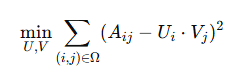

# 추천시스템

## 추천 시스템 개요 및 구조
추천 시스템은 사용자에게 적합한 항목을 제공하는 시스템으로, 주로 다음 세 가지 주요 단계로 구성됩니다.

- 후보 생성 (Candidate Generation): 방대한 항목 집합에서 사용자에게 적합할 수 있는 후보 항목을 빠르게 선정합니다. 예를 들어, 유튜브에서는 수십억 개의 동영상 중 수백 개를 후보로 압축해냅니다.
- 스코어링 (Scoring): 생성된 후보 항목을 평가하여 최종 추천을 위한 순위를 부여합니다.(top 10 정도...)
- 재정렬 (Re-ranking): 최종 추천 항목을 사용자 선호, 신선함, 다양성 등을 고려하여 다시 정렬합니다.

### 후보 생성 방식
- 콘텐츠 기반 필터링 (Content-based Filtering)
  - 사용자가 선호하는 항목과 유사한 콘텐츠를 추천하는 방식입니다. 예를 들어, 사용자가 고양이 영상을 시청하면, 관련된 다른 귀여운 동물 영상이 추천됩니다.
  - 장점
    - 사용자의 특정 관심사를 잘 반영할 수 있다
    - 다른 사용자의 데이터 없이도 작동할 수 있습니다.
  - 단점
    - 항목 특징이 도메인 전문가가 수작업으로 설계되어야 함 
    - 사용자의 기존 관심사에 기반하므로 새로운 취향을 확장하기 어렵습니다.
- 협업 필터링 (Collaborative Filtering)
  - 다른 사용자와의 유사성을 바탕으로 항목을 추천합니다. 예를 들어, 비슷한 관심사를 가진 사용자가 좋아하는 항목을 추천합니다.
  - 장점
    - domain knowledge가 필수적이지 않으며 시작점으로 좋다
    - 우연한 추천이 가능해 사용자가 새로운 관심사를 발견하는 데 도움을 줍니다.
    - 사용자와 항목 간의 유사성을 자동으로 학습한다.
  - 단점
    - 새로운 항목의 추천이 어려운 콜드 스타트 문제가 발생하며, 추가 정보를 포함하기 어렵습니다.

### 임베딩 및 유사도 측정
추천 시스템에서 **임베딩(embedding)** 은 item과 query를 저차원 벡터 공간에 매핑하여 유사성을 계산합니다.

- 유사도 측정 방법
  - 코사인 유사도: 각도 기반의 유사도로, 벡터 간의 방향을 비교하여 유사성을 측정합니다.
  - 내적(dot product): 벡터의 크기를 고려한 유사도로, 빈도가 높은 항목은 더 큰 유사도를 가지게 됩니다.
    - user embedding x, app embedding y는 binary vector로 구성됨(1, 0)
  - 유클리디안 거리: 벡터 간 거리를 측정하여 짧을수록 유사성이 높다고 평가합니다.
  - 
  - 뭘 선택해야 하는가?
    - 크기에 민감해서 인기 상품 우지로 추천할거면 dot product
    - 마이너 상품 같은 추천이면 다른 측정방식

### 매트릭스 분해(Matrix Factorization) 기반의 목적 함수(Objective Function)
추천 시스템에서 매트릭스 분해는 사용자와 항목의 피드백 행렬을 분해하여 사용자 임베딩과 항목 임베딩을 학습합니다.
목표는 실제 피드백과 예측된 피드백 간의 오차를 최소화하는 것입니다.
- 수식
  - 
  - A_ij는 사용자 i가 항목 j에 대해 남긴 피드백
  - U와 V는 각각 사용자와 항목의 임베딩 벡터
- Weighted Matrix Factorization : feedback matrix가 1로만 구성되면 효과적이지 못하니 관찰안된 부분은 0 추가
- Objective function 최소화
  - 확률적 경사 하강법(SGD)
    - 장점: 매우 유연하며 병렬처리 가능
    - 단점: 느리고 관찰되지 않은 것에 처리가 어렵다
  - 가중치 교차 최소 제곱법(WALS)
    - 사용자의 임베딩과 항목의 임베딩을 번갈아 고정하고 최적화
    - 병렬 처리 가능하며 SGD보다 빠르다.
    - 관찰되지 않은 것에 처리가 비교적 쉽다
- 한계
  - 모델은 그래프 구조를 명시적으로 포착하지 않는다.

### GNN의 활용
- 추천시스템에 활용 이점
  - 그래프 구조를 명확하게 반영하여 사용자와 항목 간의 복잡한 상호작용을 잘 표현할 수 있음
  - 콜드 스타트 문제나 희소한 데이터 문제에 효과적
  - 자연스럽게 사이드 정보 통합 가능
  - inductive setting 가능

- 구조
  - 두 가지 노드 유형이 있다.(사용자, 항목)
  - 사용자와 항목간 edge가 연결되며 의미는 다양하게 가능하다.
  - 자연스럽게 쌍방향 그래프 구조로 모델링된다.
  - link prediction 간선이 있을 가능성(구매 가능성) 등으로 활용 가능

- PinSAGE와 같은 모델이 대규모 그래프에서 GNN을 효과적으로 사용하는 예시로, Pinterest와 같은 대규모 콘텐츠 추천 시스템에서 활용됩니다.
  - Pinterest: 저장된 유저 이미지 기반으로 비슷한 이미지 추천(인근 노드로부터 정보를 가져옴)
  - PinSAGE: GNN을 사용하여 리치 노드 속성과 그래프 구조를 모두 캡처하는 고품질 사용자/아이템 임베딩을 생성한다.
  - 케이크 핀을 조회하면 유사한 케이크 추천(예를 들어 스웨터 이미지의 임베딩과의 거리는 멀어서 추천X)
  - 몇가지 방법론 제시
    - 정교한 음성 샘플링 전략을 사용하여 효과적으로 훈련됨
    - 미니배치 내에 부정적 샘플을 공유(비용 감수)
    - Curriculum learning: 음성 샘플의 난이도를 epoch마다 높여서 더 잘하게 만든다.

### 평가지표
보통 top-k 방식으로 추천하는데 이를 위한 평가 주요 지표들은 다음과 같습니다.

- 정확도(Accuracy): 맞게 예측한 비율로, 대칭적인 데이터셋에 유리합니다.
- 정밀도(Precision): 추천된 항목 중 실제 사용자가 선호한 항목의 비율을 측정합니다.
- 재현율(Recall): 실제로 선호한 항목 중 추천된 항목의 비율입니다.
  - 
- F1 스코어: 정밀도와 재현율을 함께 고려하는 조화 평균 지표입니다.
- ROC CURVE
  - 
- ROC AUC: 클래스 구분 성능을 측정하는 지표로, TPR 대 FPR의 그래프 아래 면적을 의미합니다.
- Mean Reciprocal Rank(MRR): 가장 높은 순위에 있는 관련 항목의 순위의 역수를 평균한 값. 클수록 좋음
  - 사용자에게 가장 적합한 항목을 검색하는데 적합
  - 
- Hits@K: 추천된 상위 K개의 항목 중에 사용자가 실제로 관심을 가질 항목이 포함되어 있는지 측정
- Surrogate Loss Function
  - 추천 시스템에서는 정확도, 정밀도, 재현율과 같은 지표를 평가 지표로 사용하지만, 이들은 일반적으로 미분 가능하지 않아 경사 하강법으로 최적화하기 어렵습니다. 이를 해결하기 위해 이러한 지표와 잘 맞는 대체 손실 함수를 사용하여 최적화를 진행합니다.
  - Binary Loss
    - Binary Loss는 사용자와 항목 간의 상호작용을 이진 분류 문제로 다루며, 추천할 항목(positive sample)과 추천하지 않을 항목(negative sample)을 구분하는 손실 함수입니다.
    - 추천이 특정 사용자에게 맞춰지지 않고, 전체적으로 높은 점수를 얻도록 최적화되는 경향이 있어 개인화된 추천에는 적합하지 않다.
  - Bayesian Personalized Ranking (BPR)
    - 개인화된 순위 학습을 위한 손실 함수로, 사용자가 선호하는 항목이 그렇지 않은 항목보다 높은 점수를 갖도록 하는 방식이다.
    - recall@K와 같은 개인화 지표와 잘 맞는다.